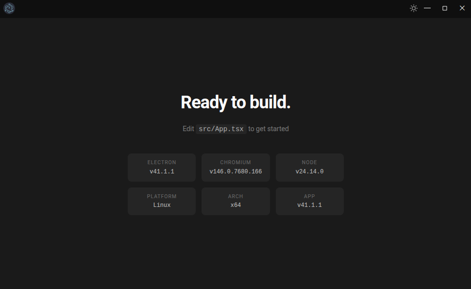

# Electron React TS Vite Tailwind Boilerplate

A modern boilerplate for building cross-platform desktop applications with **Electron 41**, **React 19**, **TypeScript 6**, **Vite 8**, and **Tailwind CSS 4**.



---

## Features

- **Electron 41** — Cross-platform desktop apps with native `protocol.handle` for production file serving
- **React 19 & TypeScript 6** — Strongly-typed UI with the latest language features
- **Vite 8** — Blazing fast dev server and Rolldown-powered production builds
- **Tailwind CSS 4** — CSS-first configuration with `@theme`, `@variant`, and `@utility` directives
- **esbuild** — Fast bundling for the Electron main process
- **ESLint 10** — Flat config with TypeScript and React plugins
- **bun** — Package manager and runtime

---

## Requirements

- **Node.js** 20+
- **bun**

---

## Installation

```bash
bun install
```

---

## Usage

### Development

Start the full Electron dev environment (Vite dev server + esbuild watch + electronmon):

```bash
bun run electron:dev
```

Or run only the Vite renderer dev server (no Electron):

```bash
bun run dev
```

### Build

Generate optimized production files:

```bash
bun run build
```

### Packaging

Package the app with electron-builder:

```bash
bun run dist
```

### Linting

```bash
bun run lint
```

---

## Project Structure

```
.
├── main/                          # Electron main process
│   ├── lib/
│   │   ├── buttons/
│   │   │   ├── maximize.ts
│   │   │   └── minimize.ts
│   │   ├── create-window.ts
│   │   ├── get-url.ts
│   │   ├── handle-protocol.ts
│   │   ├── is-dev.ts
│   │   ├── register-ipc.ts
│   │   └── types.ts
│   ├── index.ts
│   ├── preload.ts
│   └── tsconfig.json
├── src/                           # React renderer process
│   ├── components/
│   │   ├── CloseButtons.tsx
│   │   ├── Header.tsx
│   │   ├── Placeholder.tsx
│   │   └── ThemeToggle.tsx
│   ├── hooks/
│   │   ├── use-electron.ts
│   │   ├── use-system-info.ts
│   │   ├── use-theme.ts
│   │   └── use-titlebar.ts
│   ├── lib/
│   │   └── platform-names.ts
│   ├── styles/
│   │   └── index.css
│   ├── App.tsx
│   ├── electron.ts
│   └── main.tsx
├── public/                        # Static assets
├── docs/                          # Documentation assets
├── electron-builder.config.js
├── esbuild.config.mjs
├── eslint.config.js
├── index.html
├── package.json
├── tsconfig.json
├── tsconfig.renderer.json
├── tsconfig.vite.json
└── vite.config.ts
```

---

## Architecture

The app is split into two processes, each with its own build pipeline and TypeScript config:

### Main Process (`main/`)

| File | Description |
|------|-------------|
| `main/index.ts` | Thin orchestrator: protocol setup, window creation, IPC registration |
| `main/preload.ts` | Context bridge exposing `window.electron` API to the renderer |
| `main/lib/create-window.ts` | BrowserWindow factory with fullscreen titlebar toggle |
| `main/lib/register-ipc.ts` | IPC handler registration (receives `BrowserWindow` via DI) |
| `main/lib/handle-protocol.ts` | Custom `app://` protocol using `protocol.handle` + `net.fetch` |
| `main/lib/get-url.ts` | URL routing: `localhost:5173` in dev, `app://` in production |
| `main/lib/is-dev.ts` | Dev detection via `ELECTRON_IS_DEV` env or `app.isPackaged` |
| `main/lib/buttons/` | Window control handlers (minimize, maximize) — receive `BrowserWindow` as parameter |

- Built by **esbuild** to CJS (`.cjs`) in `app/`
- Path alias: `@core/*` maps to `main/*`

### Renderer Process (`src/`)

| File | Description |
|------|-------------|
| `src/main.tsx` | React entry point |
| `src/App.tsx` | Root component |
| `src/electron.ts` | Type declarations for the `window.electron` preload API |
| `src/components/` | UI components (Header, CloseButtons, ThemeToggle, Placeholder) |
| `src/hooks/` | Custom hooks (use-electron, use-titlebar, use-theme, use-system-info) |
| `src/lib/` | Utilities (platform-names) |
| `src/styles/index.css` | Tailwind v4 config + custom utilities |

- Built by **Vite** to `app/renderer/`
- Path alias: `@/*` maps to `src/*`

### IPC

The preload script (`main/preload.ts`) exposes a typed API via `contextBridge.exposeInMainWorld("electron", api)`. Renderer components access it through the `useElectron()` hook.

The renderer types are derived directly from the preload: `src/electron.ts` imports `typeof api` from `main/preload.ts` and declares it on `Window`. The preload is the **single source of truth** for the IPC API — any new method added there is automatically typed in the renderer.

Available IPC channels:

| Channel | Type | Description |
|---------|------|-------------|
| `app:minimize` | send | Minimize the window |
| `app:maximize` | send | Toggle maximize/restore |
| `app:close` | send | Quit the app |
| `app:system-info` | invoke | Returns platform, arch, Electron/Chrome/Node versions |

### Tailwind CSS 4

Configured entirely in CSS (`src/styles/index.css`), no `tailwind.config.js`:

- Dark mode via `@variant dark` (class-based, toggles on `<html class="dark">`)
- Custom colors: `main-onyx`, `main-obsidian`, `divider-dark`, `light-bg`, `light-hover`, `close-red`
- Custom utilities: `drag`, `no-drag` (Electron window drag regions)
- Integrated via `@tailwindcss/vite` plugin

### Build Output

- `app/` — Runtime output (main process `.cjs` + renderer build)
- `dist/` — Packaged electron-builder output

---

## License

[MIT](./LICENSE)
